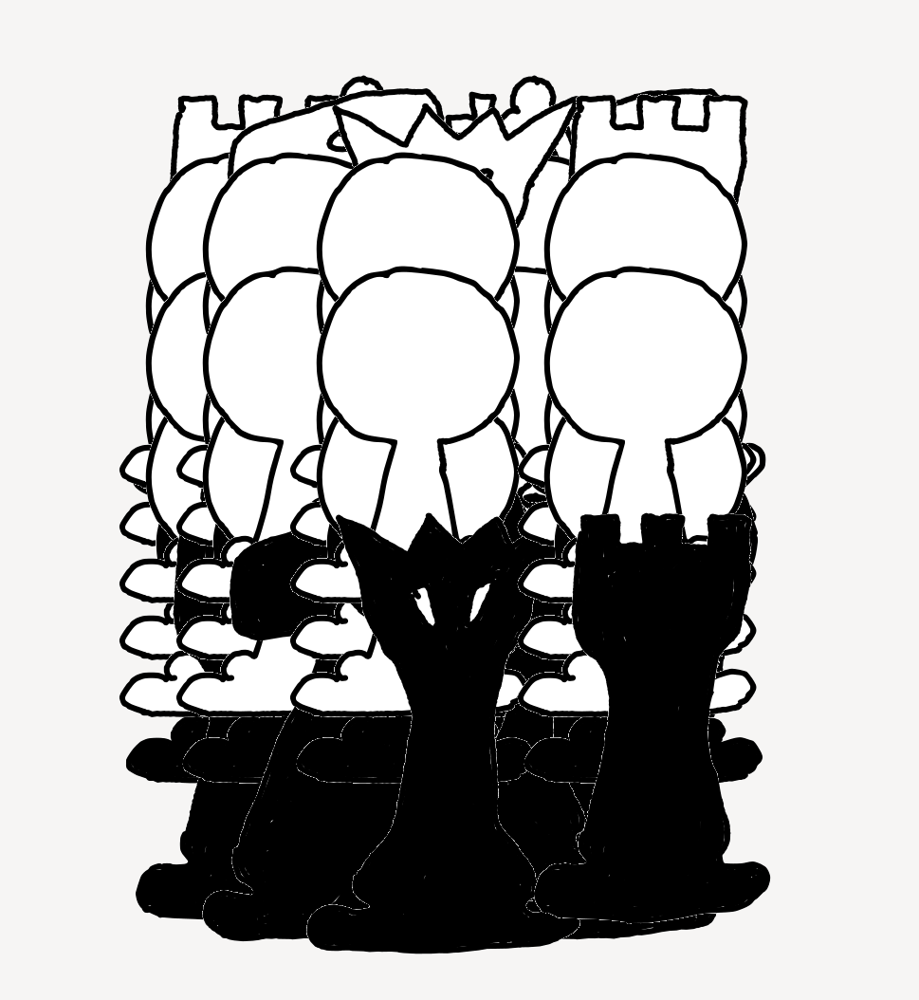

# hChess

# run tests

    nix-shell
    cabal test

# Start app with GUI

on ice for now, wont work yet

    nix-shell
    cabal run hchess-gui

# start app

    nix-shell
    cabal run hchess
    
# Run profiling

    nix-shell
    ./prof.sh

outputs hchess-profiled.hp and hchess-profiled.prof

# Install binary locally

    nix-env -i -f release.nix